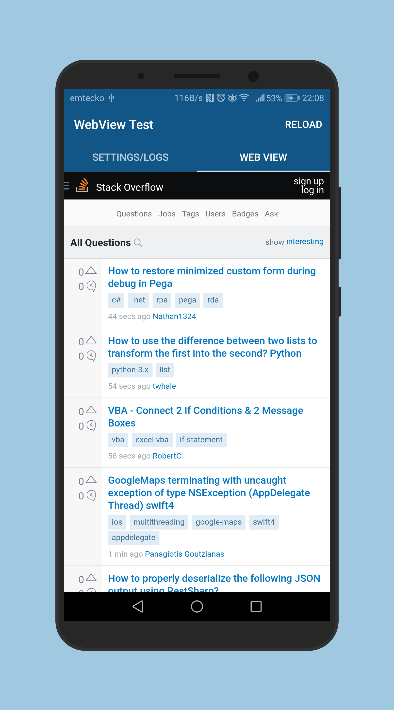

# WebView Tester

Simple app for testing web applications in Androids web view.

Enter URL of your web application and test it's functionality in provided web view. If you need to see the logs your web app makes to console, there can be viewed in the first tab of the application. Supports Android 4.0 (API 14) and up. 

Contains no ads, it's completely free and open-source. If it doesn't have the features you want, create an issue and ask for it or better yet - implement it and send a merge request! ;)